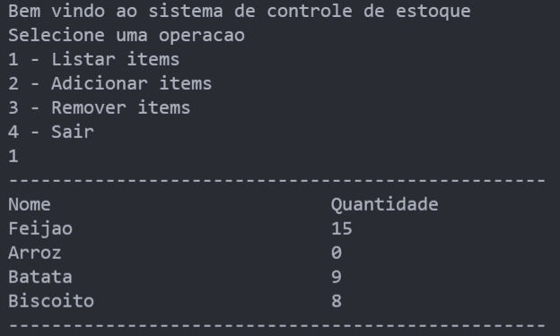
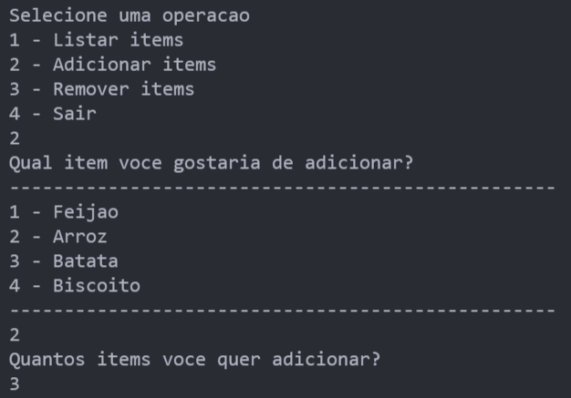
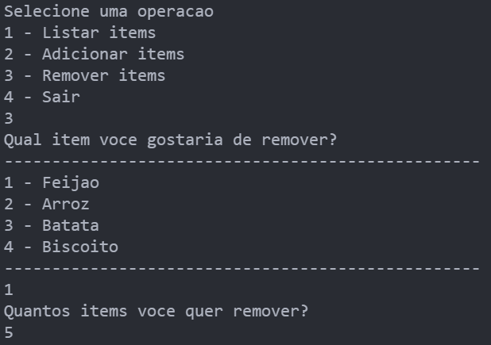

# Controle de Estoque em C

Esse é um simples controle de estoque codificado em C. Parte da série "Programando com o Neps".

Você pode conferir a live em que esse projeto foi feito clicando na imagem abaixo:

Algumas funções implementadas são:

- Listar itens

- Adicionar itens

- Remover itens

O programa carrega os dados em um arquivo chamado `storage.txt` e salva as modificações após cada operação.
